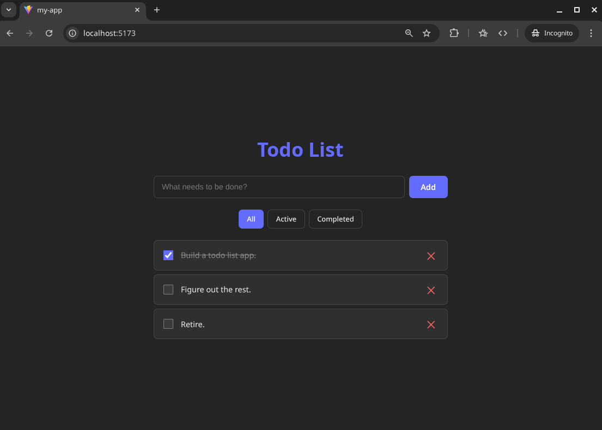

# Simple Todo List

A simple, lightweight todo list application built with React and TypeScript for demonstration purposes.



## Features

- **Add todos**: Create new tasks with a simple input form
- **Toggle completion**: Mark todos as complete or incomplete with a checkbox
- **Delete todos**: Remove tasks you no longer need
- **Filter by status**: View all todos, only active ones, or only completed ones
- **Client-side storage**: All todos are automatically saved to localStorage and persist across page refreshes

## Tech Stack

- React 19
- TypeScript 5
- Vite 7
- Local Storage for data persistence

## Getting Started

```bash
# Install dependencies
npm install

# Start development server
npm run dev
```
